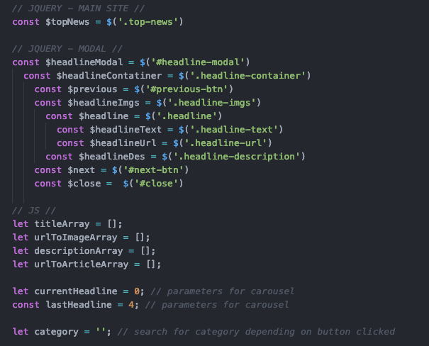
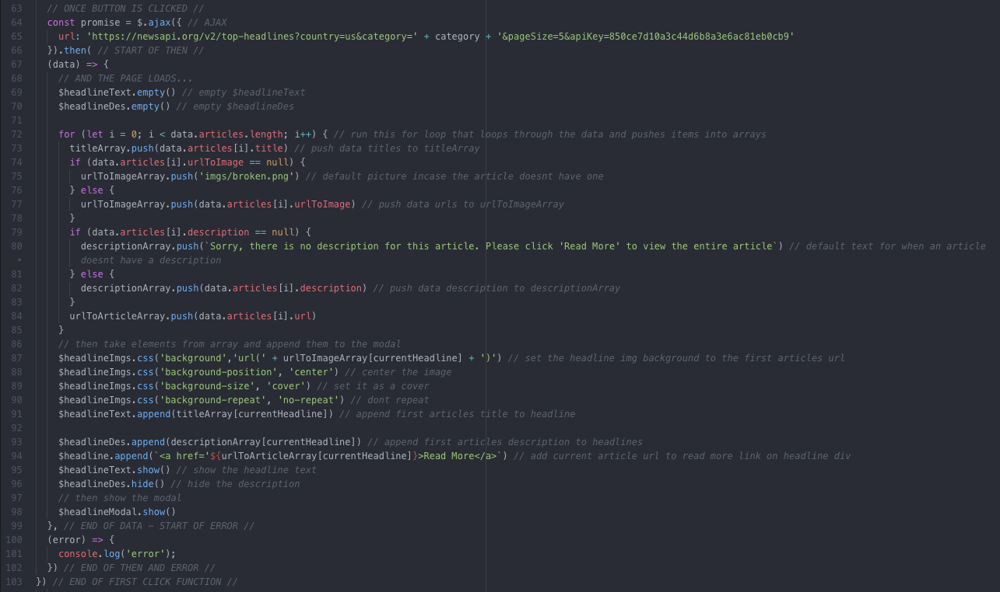
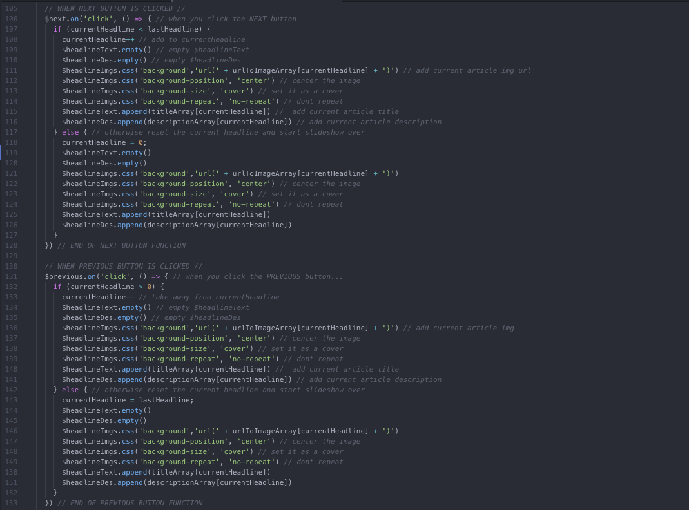

# [Top News](https://gnola.github.io/news_app/)

#### Tech Used:
HTML / CSS / JavaScript / jQuery / [News API](https://newsapi.org/)

## About the App
This single page news application allows users to view the current news headlines in real time. Depending on the category the user chooses, the app will utilize the API connected to the app and will deliver the top 5 headlines within that category.

## Navigating the App
When the page loads users are presented with 7 options of articles to view based on specific categories (General, Business, Entertainment, Health, Science, Sports and Tech). When a category button is clicked, a modal of the top headline is shown. Users can move through each of the 5 articles using the previous and next arrow buttons. Clicking on the image of the headline will toggle a description of the article. If the user is interested in reading more from that specific article they can click on the 'read more' link, which will take them to the original article. The close button at the top right corner of the modal will allow users to exit and return back to the main site to then choose another category.

## Behind the Scenes
Variables Utilized:

First Click Function and AJAX:

Modal and Carousel:

## Recap
I originally wanted to use a different API but it gave me too much trouble so I pivoted to the news API instead. Due to this faulty API I don't believe I was able to be as creative with the functionality of the app as a whole and was a bit disappointed in the simplicity of my app. Although I wasn't able to implement as much creativity as I wanted to I was able to implement all the functionality I saw fit. Instead, I took the opportunity to focus more on the design aspect in order to get more practice in such aspects. I do believe though that the design of my app is impactful in helping such small functionality be more potent to the user. Other than that I believe that my code could be a bit DRYer but overall believe it to be pretty straightforward and easy for someone else to look at and understand what is going on.
