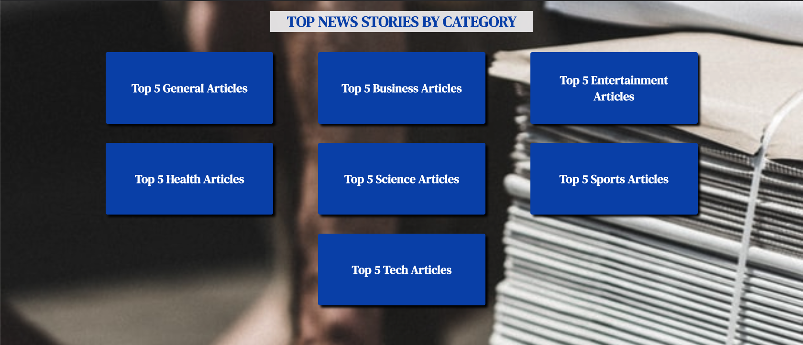

# TOP NEWS
[Top News App](https://gnola.github.io/news_app/)
Tech Used: HTML / CSS / JavaScript / jQuery / [News API](https://newsapi.org/)
Author: Gianni Nola

## About the App
This news app allows you to see the current top news headlines in almost real time. Depending on the category you choose, the app will utilize the API connected to the app and will deliver the top 5 headlines within that category.

## Navigating the app
When the page loads you are presented with 7 options of articles to view based on specific categories (General, Business, Entertainment, Health, Science, Sports and Tech).

When a button is clicked, a modal of the top headline is shown. You are able to toggle the description of the article by clicking on the headline image. If you are interested in reading more from that specific article you can click on the read more link which will then take you to the article in a different tab. You can use the previous and next arrow buttons to move through the top 5 articles within that category. The close button at the top right corner of the modal will allow you to exit and return back to the main site to then choose another category.

## Code Snippits
Variables Utilized:

First Load and Click Function:

AJAX:

## Pros and Cons
Utilizing an API database to grab current news headlines and presenting them within my site. I originally wanted to use a different API but it gave me too much trouble so I pivoted to the news API instead. Due to this faulty API I don't believe I was able to be as creative with the functionality of the app as a whole and was a bit disappointed in the simplicity of my app. Although I wasn't able to implement as much creativity as I wanted to I was able to implement all the functionality I saw fit. Instead, I took the opportunity to focus more on the design aspect in order to get more practice in such aspects. I do believe though that the design of my app is impactful in helping such small functionality be more potent to the user. Other than that I believe that my code could be a bit DRYer but overall believe it to be pretty straightforward and easy for someone else to look at and understand what is going on
